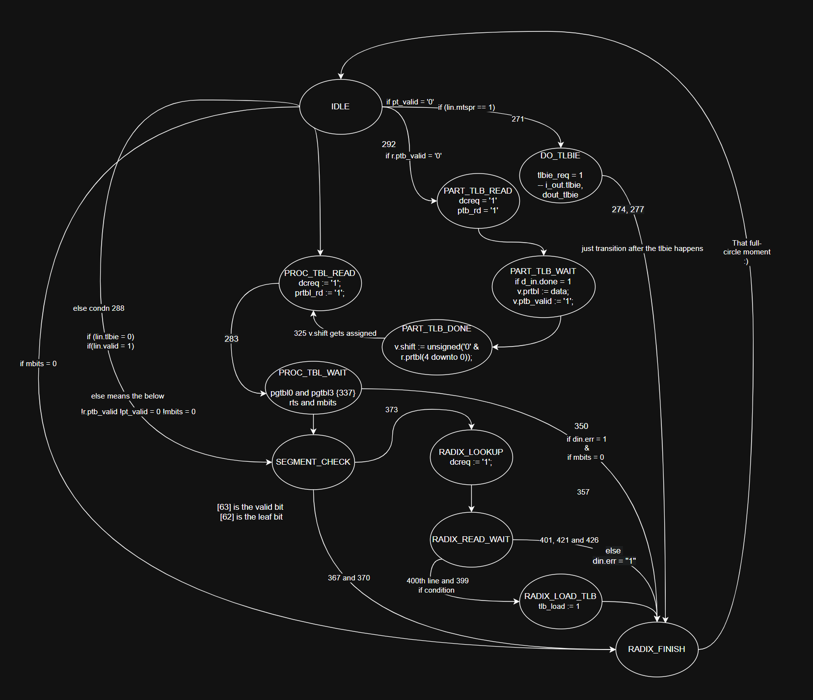
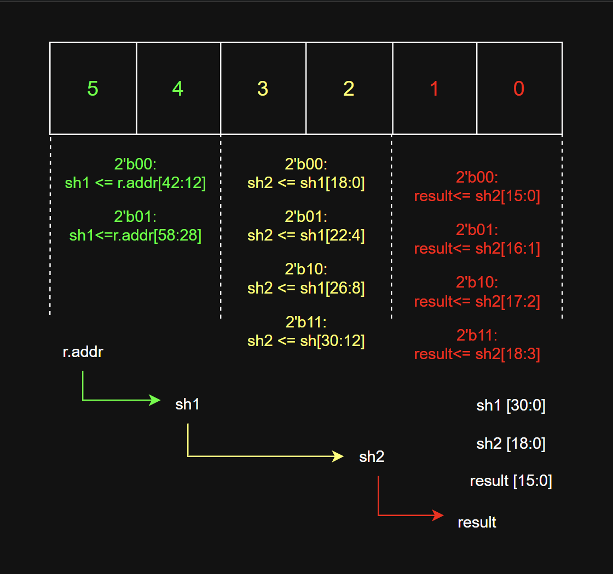

# 01 — Background and problem statement

[← Index](00-README.md) · Next: [02 — The state machine](02-fsm.md)

---

## 1.1 Why this project exists

The A2O core is an out-of-order OpenPOWER processor implementing **Power ISA 2.07, Book
III-E** (the *embedded* book). Its upstream release notes state the compliance gap directly:

> The A2O core is compliant to Power ISA 2.07 and will need updates to be compliant with
> either version 3.0c or 3.1. Changes will include:
> * **radix translation**
> * op updates, to eliminate noncompliant ones and add missing ones …
> * various 'mode' and other changes … (III-E needs to be changed to III)

Radix translation is the first item. This work addresses it.

A search of the entire A2O source tree for radix terminology
(`radix|ptcr|prtbl|rpds|rts|partition table|process table|sdr1|patb`) returns **zero hits**.
There was no partial implementation to finish — the mechanism had to be added.

## 1.2 What radix translation is

Radix translation (ISA 3.0B §6.7.10, ISA 3.1C pp. 1198–1203) walks a tree of page
directories to convert an effective address to a real address. The walk is:

```
PTCR (SPR 464)  ──►  partition table entry  ──►  process table entry
                                                        │
                                                        ▼
                        root page directory  ──►  … up to 4 levels …  ──►  leaf PTE
```

Three fields control the shape of the tree:

| Field | Where | Meaning |
|---|---|---|
| **RTS** | process table entry (PRTE0) | Radix Tree Size. Address space is `RTS + 31` bits |
| **RPDS** | process table entry | Root Page Directory Size — index width of the first level |
| **NLS** | each directory entry (PDE) | Next Level Size — index width of the level below |

Each level consumes `NLS` bits of the effective address to index an array of 8-byte entries.
A directory entry (leaf bit clear) supplies the base of the next level; a leaf entry (leaf
bit set) supplies the real page number and the access permissions. Legal index widths are
5–16 bits.

There is no fixed depth. The walk terminates when a leaf is found, and the guard against
running off the bottom of the tree is arithmetic: the remaining shift amount decreases by
`NLS` at each level, and a level claiming more bits than remain is a malformed tree.

## 1.3 What A2O had instead: Book-E E.PT

A2O's hardware tablewalker (`mmq_htw.v`, 2864 lines) implements Book-E category **E.PT**,
the "indirect TLB entry" scheme. The mechanism is entirely different:

1. Software installs a TLB entry with `IND=1` covering a 1 MB or 256 MB region.
2. That entry's RPN field is **not** a translation — it is the real base address of a flat
   array of page-table entries for the region.
3. On a TLB miss that hits the indirect entry, the walker computes
   `PTE_address = {PTRPN, EPN_low_bits, 3'b000}` and issues **exactly one** 8-byte load.
4. The returned doubleword *is* the PTE and is written straight into a TLB way.

One memory access. One level. No root register, no level counter, no address accumulator.
The walker's own sequencer is only two bits wide:

```verilog
// mmq_htw.v:164-167
parameter [0:1]  HtwSeq_Idle = 2'b00;
parameter [0:1]  HtwSeq_Stg1 = 2'b01;   // form the PTE address
parameter [0:1]  HtwSeq_Stg2 = 2'b11;   // issue the load, wait for the grant
parameter [0:1]  HtwSeq_Stg3 = 2'b10;   // (declared, never used)
```

This is the gap the project closes: a three-state, one-load sequencer had to become a
twelve-state, multi-load, restartable walk.

## 1.4 What Microwatt has: the reference implementation

Microwatt is a small in-order, single-threaded OpenPOWER core whose `mmu.vhdl` implements
the full ISA 3.0B/3.1 radix tree. It is a good source to port *from* for three reasons: it
is complete, it is small enough to read in full (1878 lines), and it is permissively
licensed.

Its main sequencer has twelve states:

```vhdl
-- microwatt/mmu.vhdl:29-41
type state_t is (IDLE, DO_TLBIE, PART_TBL_READ, PART_TBL_WAIT,
                 PROC_TBL_READ, PROC_TBL_WAIT, SEGMENT_CHECK, TLBWAIT,
                 RADIX_LOOKUP, RADIX_READ_WAIT, RADIX_LOAD_TLB, RADIX_FINISH);
```

The FSM as documented earlier in this repository (state numbers are `mmu.vhdl` line
references, edge labels are transition conditions):



And the address shifting and masking that extracts each level's index:



Two properties of Microwatt matter for the port, and both are consequences of it being
in-order:

- **`tlbie` is dispatched through the same FSM as a walk** (`mmu.vhdl:1524-1525`,
  `1571-1574`). Because the MMU is in `DO_TLBIE`, it structurally cannot simultaneously be
  in `RADIX_READ_WAIT`. Invalidate-versus-walk races are impossible by construction.
- **One outstanding request.** There is no queue; `loadstore1` serialises everything.

Neither property holds in A2O. This is the subject of [05-ooo-safety](05-ooo-safety.md).

## 1.5 Structural comparison

| Aspect | Microwatt | A2O |
|---|---|---|
| Architecture | ISA 3.0B/3.1 **radix** | Book-E / ISA 2.06 **embedded** |
| Walk depth | up to **4 levels** | **1 level** (E.PT indirect entry) |
| Root pointer | `PTCR` → partition table → process table | **none** — base is in an IND=1 TLB entry |
| Main FSM | 12 states | 33 states, 6-bit Gray-coded (`mmq_tlb_ctl.v:343-375`) |
| Main TLB | 256 entries, 4-way, 4 kB only | **512 entries, 4-way, 128 rows**, 8 page sizes |
| TLB entry | 64-bit PTE | **168-bit way** (`mmu_a2o.vh:187-206`) |
| TLB tag | EA[51:20] + 12-bit PID | **122-bit tag** (`mmu_a2o.vh:148-185`) |
| Match | RAM read + comparator | **4× matchline CAM**, per-field enables |
| Page-walk cache | yes, 256 entries | **none** |
| Hypervisor level | partition table, **vestigial** | **LRAT**, 8-entry, LPID-keyed, real exception |
| Memory port | direct to dcache, 1 outstanding | via arbiter to L2, **2 core tags, 1 credit token** |
| Data return | 64-bit word | 4× 128-bit quadword beats on the reload bus |
| R/C bits | checked only, no writeback | folded into permissions at reload, no writeback |
| Real address | 56 bits | **42 bits** (`mmu_a2o.vh:108`) |
| Page sizes | 4 K / 64 K / 2 M / 1 G | 4 K / 64 K / 1 M / 16 M / 1 G |
| Threads | 1 | **2**, out-of-order |

The rows in bold type are the ones that forced design decisions. Three deserve emphasis:

- **42-bit real addresses.** Microwatt forms 56-bit page-table addresses. A tree built for a
  wider machine can point outside what A2O can address; the walker treats that as a machine
  check rather than truncating silently.
- **No 2 MB page size.** Discussed in [03-datapath](03-datapath.md#36-leaf-size-demotion).
- **One credit token.** The MMU may have only one request outstanding to the load/store
  unit, and that port is shared with TLB invalidate broadcasts. A four-level walk is four
  serial round trips to the L2.

## 1.6 A note on terminology

Two terms are easy to confuse and are used precisely throughout this documentation:

- **one-hot** describes an encoding where exactly one bit is set. A2O's TLB sequencer is
  *not* one-hot; it is Gray-coded binary. The one-hot fields in A2O are the tag's operation
  type and thread identifier.
- **one-shot** describes A2O's *walk*: a single memory access, not a single-bit encoding.

---

**Not covered here:** the new state machine ([02](02-fsm.md)), the bit-level transcription
([03](03-datapath.md)), or how the module is wired into the core ([04](04-integration.md)).
