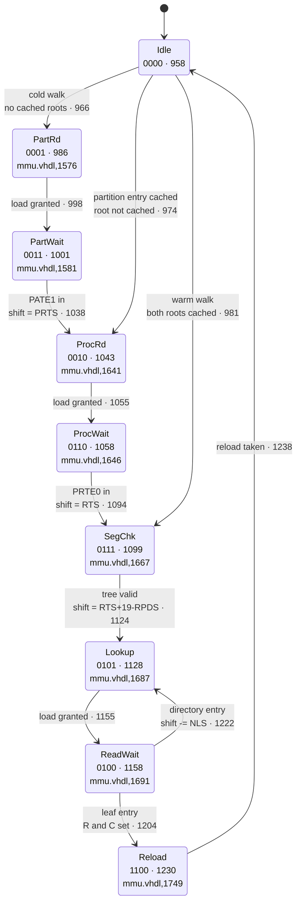
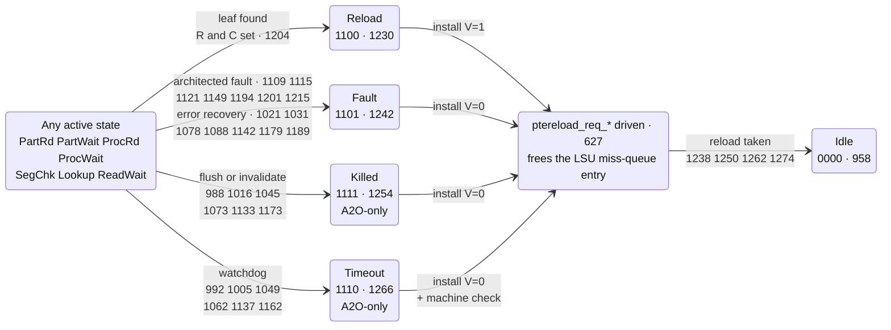
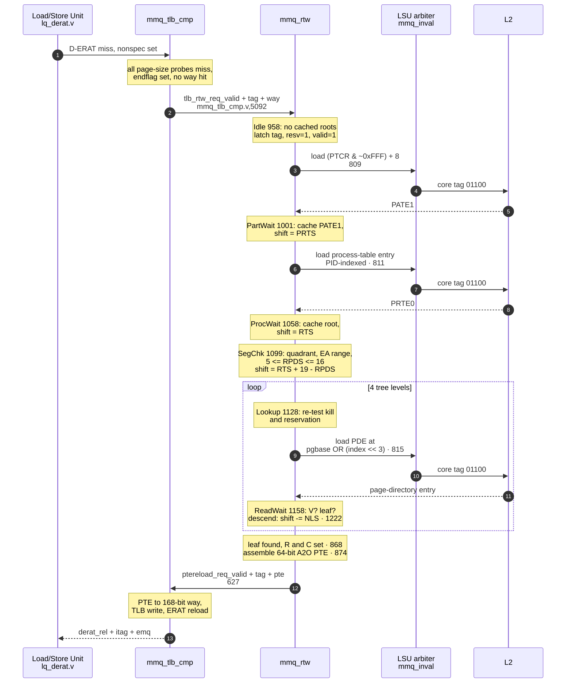

# 02 — The state machine

[← 01 Background](01-background.md) · [Index](00-README.md) · Next: [03 — Datapath](03-datapath.md)

The walker is `rel/src/verilog/work/mmq_rtw.v`. It contains **two independent walk
contexts**, each running its own copy of the sequencer described here, statically bound one
per hardware thread. This document describes one context.

---

## 2.1 State encoding

Twelve states, four bits (`mmq_rtw.v:213-224`):

```verilog
// Idle is all-zeros so that an AND-mask kill returns to Idle, matching the
// tlb_seq_abort idiom at mmq_tlb_ctl.v:1376-1378.
// Single-bit transitions along the nominal path, as in mmq_tlb_ctl.v:343-375.
parameter [0:3] RtwSeq_Idle     = 4'b0000;
parameter [0:3] RtwSeq_PartRd   = 4'b0001;
parameter [0:3] RtwSeq_PartWait = 4'b0011;
parameter [0:3] RtwSeq_ProcRd   = 4'b0010;
parameter [0:3] RtwSeq_ProcWait = 4'b0110;
parameter [0:3] RtwSeq_SegChk   = 4'b0111;
parameter [0:3] RtwSeq_Lookup   = 4'b0101;
parameter [0:3] RtwSeq_ReadWait = 4'b0100;
parameter [0:3] RtwSeq_Reload   = 4'b1100;
parameter [0:3] RtwSeq_Fault    = 4'b1101;
parameter [0:3] RtwSeq_Killed   = 4'b1111;
parameter [0:3] RtwSeq_Timeout  = 4'b1110;
```

Two properties of the encoding are deliberate and follow A2O house style:

- **`Idle` is all zeros.** A2O's existing TLB sequencer aborts by AND-masking its state
  vector to zero, which only works as "return to idle" because idle is zero
  (`mmq_tlb_ctl.v:1376-1378`). The same idiom disables this walker when radix is off:
  `ctx_seq_din[i] = ctx_seq_d[i] & {4{mmucr1_rxe}}`.
- **The nominal path is single-bit adjacent.** `Idle → PartRd → PartWait → ProcRd →
  ProcWait → SegChk → Lookup → ReadWait` changes exactly one bit per step, matching the Gray
  coding of `mmq_tlb_ctl.v:343-375`.

## 2.2 State table

> **Reference convention, used in the tables and diagrams below.** A bare number is a line
> in `mmq_rtw.v`. A reference of the form `file,line` names a different file — so
> `mmu.vhdl,1667` is the Microwatt original.

| State | Enc | Arm | Microwatt origin | Purpose | Exits to |
|---|---|---|---|---|---|
| `Idle` | `0000` | 958 | `mmu.vhdl,1505` | Wait for a handoff; decide how much of the tree is already cached | `PartRd` / `ProcRd` / `SegChk` |
| `PartRd` | `0001` | 986 | `mmu.vhdl,1576` | Request the partition-table entry at `(PTCR & ~0xFFF) + 8` | `PartWait`, `Killed`, `Timeout` |
| `PartWait` | `0011` | 1001 | `mmu.vhdl,1581` | Await PATE1; cache it; extract PRTS | `ProcRd`, `Fault`, `Killed`, `Timeout` |
| `ProcRd` | `0010` | 1043 | `mmu.vhdl,1641` | Request the process-table entry, indexed by PID | `ProcWait`, `Killed`, `Timeout` |
| `ProcWait` | `0110` | 1058 | `mmu.vhdl,1646` | Await PRTE0; cache it; extract RTS | `SegChk`, `Fault`, `Killed`, `Timeout` |
| `SegChk` | `0111` | 1099 | `mmu.vhdl,1667` | Validate quadrant, address range and tree sanity | `Lookup`, `Fault` |
| `Lookup` | `0101` | 1128 | `mmu.vhdl,1687` | Request one page-directory entry | `ReadWait`, `Killed`, `Fault`, `Timeout` |
| `ReadWait` | `0100` | 1158 | `mmu.vhdl,1691` | Decode the entry: leaf, descend, or fault | `Reload`, `Lookup`, `Fault`, `Killed`, `Timeout` |
| `Reload` | `1100` | 1230 | `mmu.vhdl,1749` | **Terminal, success.** Present the translation | `Idle` |
| `Fault` | `1101` | 1242 | `mmu.vhdl,1753` | **Terminal, architected fault.** Present V=0 | `Idle` |
| `Killed` | `1111` | 1254 | **A2O-only** | **Terminal, flushed or invalidated.** Present V=0 | `Idle` |
| `Timeout` | `1110` | 1266 | **A2O-only** | **Terminal, watchdog.** Present V=0, machine check | `Idle` |

Ten of the twelve states are transcribed from Microwatt. `Killed` and `Timeout` have no
counterpart there and exist solely because A2O is out-of-order — see
[05-ooo-safety](05-ooo-safety.md). Microwatt's `TLBWAIT` and `DO_TLBIE` were deliberately
**not** ported: A2O's own TLB sequencer and invalidate sequencer already cover arbitration
and invalidation.

All four terminal states drive the same output handshake. That is not redundancy. It is the
property that prevents the load/store unit's miss queue from leaking entries, and it is
explained in [§2.6](#26-why-every-exit-goes-through-the-same-handshake).

## 2.3 State diagram

The machine is drawn as two diagrams. Drawn as one graph, the sixteen abort and return edges
— every active state to `Killed` and to `Timeout`, every terminal back to `Idle` — cross the
twelve edges that advance a walk and bury them. Those sixteen carry one bit of information
between them: *every* active state aborts identically. Collapsing them loses nothing.

### Diagram A — the nominal walk

Only the transitions that advance a walk. No faults, no aborts, no ECC retries.



### Diagram B — exits and the common handshake

Every state that can terminate a walk does so through the same output handshake, so the
seven active states are drawn as one node. Each edge label lists every line at which that
transition is taken, so aggregating the arrows loses no line reference.



`Shake` is not a state. It is the shared output behaviour of the four terminal states, drawn
explicitly because it is what stops the load/store unit's miss queue from leaking. See
[§2.6](#26-why-every-exit-goes-through-the-same-handshake).

Three properties of the machine that Diagram B makes visible:

- **`Fault` has fourteen entry points**, and only half are architected page-table faults
  (invalid entry, segment error, bad tree, LRAT miss). The other seven are error recovery —
  uncorrectable ECC on a table read, an exhausted retry budget, or a real address beyond the
  42 bits A2O can drive.
- **`Killed` and `Timeout` are reachable from six states each, but never from `SegChk`.**
  `SegChk` issues no memory request and completes in a single cycle, so there is nothing to
  abort and no stall for the watchdog to observe.
- **All four terminals converge before returning to `Idle`.** They share one exit path, not
  four.

## 2.4 Flow of events: a cold four-level walk

This section is written to be read on its own. It explains what a page-table walk *is*
before showing what this one does, because the sequence diagram is hard to interpret without
that background.

### 2.4.1 Why a walk happens at all

Programs address memory with **effective addresses** — the addresses in the instruction
stream. The memory system needs **real addresses** — where the data physically is. The map
between them is per-process, granular to a page (4 kB here), and far too large to hold on
chip. So it lives in memory as a **page table**, and the hardware keeps caches of the
entries it has used recently.

A2O has two such caches, in series:

| | Entries | Scope | Purpose |
|---|---:|---|---|
| **ERAT** (Effective-to-Real Address Translation) | 16 instruction-side, 32 data-side | per thread, adjacent to the pipeline | translate in the common case without leaving the unit |
| **TLB** (Translation Lookaside Buffer) | 512, 4-way | shared across threads | back the ERATs; 5 page sizes (`mmq_spr.v:382`) |

A **page-table walk** is what happens when both miss: the hardware has to go and read the map
itself. One point that is easy to miss and worth stating plainly — **the walk reads ordinary
memory**. The page table is just a data structure sitting at known real addresses, and the
walker's loads travel through the normal L2 like any other load. There is no special
"page-table memory".

### 2.4.2 What "cold" means here — three levels, not one

"Cold" in this document does *not* mean the data caches are cold. It means every cache of
the **map** missed. A walk reaching `PartRd` implies all three of:

| Level | What missed | Where |
|---|---|---|
| 1. ERAT | translation absent from the L1 translation cache | `lq_derat.v` (D-side) / `iuq_ic_ierat.v` (I-side) |
| 2. TLB | every configured page-size probe missed; `endflag` set, no way hit | `mmq_tlb_cmp.v:5092` |
| 3. Walker root cache | `ptb_valid` clear — the walker has no cached partition-table entry | 962, in the `Idle` arm |

Only the third distinguishes a *cold* walk from the *warm* walk of [§2.5](#25-the-warm-walk).
The first two are true of every walk, by definition — otherwise the request would have been
satisfied without one.

### 2.4.3 Why the page table is a tree

The obvious data structure for a map is an array indexed by page number. Work out what that
costs, using this port's own worked example — a 48-bit address space, which is what
`RTS = 17` gives (address space = `RTS + 31` bits; `mmu.vhdl:1650-1655`, `mmq_rtw.v:1058`):

- 48-bit space at 4 kB pages → 2³⁶ pages → 2³⁶ entries.
- At 8 bytes per entry: **512 GiB of page table**. For one process.

That is unusable. The reason is that address spaces are **sparse**: a process maps a little
code, a little data, a stack, and leaves almost all of the 48 bits untouched. A flat array
pays for the whole space; a tree pays only for the branches that exist.

Radix uses a tree of page directories. Each level consumes some index bits from the
effective address to select an entry, which points at the next level down:

```
EA[47:39]  EA[38:30]  EA[29:21]  EA[20:12]     EA[11:0]
   9 bits     9 bits     9 bits     9 bits      12 bits
     L1    →    L2    →    L3    →    L4     →  page offset
```

Four levels of 9 bits cover 36 bits; the remaining 12 are the offset within the page.
36 + 12 = 48. The four levels correspond exactly to the four `Lookup`/`ReadWait` iterations
in the diagram below, and to the shift value stepping 27 → 18 → 9 → 0
([§2.8](#28-the-descend-decision-and-why-there-is-no-level-counter)).

One consequence of choosing 9 is worth stating on its own:

> **9 index bits × 8 bytes per entry = 4096 bytes.** Each page directory is *exactly one
> page*. The tree is built out of the same allocation unit it describes.

A directory is therefore allocated, mapped and freed like any other page. Note that 9 is a
property of the tree the *software* builds, not of the hardware: `NLS` is read from each
directory entry and any width in 5–16 is legal (`mmu.vhdl:1719-1736`). This walker handles
whatever shape it is given; the worked example uses 9 because that is what makes a directory
one page.

The cost of the tree is **depth**: what was one array lookup is now four dependent memory
accesses. Size has been traded for pointer chasing, and §2.4.5 is about what that trade
costs.

### 2.4.4 The two indirections before the tree

The walk is six loads, not four. Two of them happen before the tree is even reached:

```
PTCR (SPR 464)  →  partition table entry  →  process table entry  →  tree root
     register            in memory                in memory
```

Neither is part of the tree. They answer the question *"where is this process's tree?"*:

- The **partition table** exists for virtualisation. In a hypervisor system each partition
  (guest) gets its own process table, so the hypervisor can give every guest an independent
  set of address spaces.
- The **process table** is indexed by `PID`, so each process within a partition gets its own
  tree root. This is what makes a context switch cheap: change `PID`, and translation follows.

**In this port, and in Microwatt, the partition table is vestigial.** The walker reads entry
0, doubleword 1, unconditionally and ignores `LPID` entirely (`809`; Microwatt does the same
at `mmu.vhdl,1846`). Those two loads currently buy generality that neither implementation
uses. A2O covers partition-scope translation with its LRAT instead.

### 2.4.5 The dependency chain — where the cost actually comes from

The cost is not the count of six loads. It is that they cannot be overlapped.

> **Level *N*'s address is computed from level *N−1*'s data.** The walker physically cannot
> issue load *N* until load *N−1* has returned.

Look at the address formation (`815`): `pgtable_addr` is built from `ctx_pgbase_q`, and
`ctx_pgbase_q` was loaded out of the *previous* directory entry. This is **pointer chasing**,
and it defeats every technique a modern core normally uses to hide memory latency:

- **Prefetching is impossible.** A prefetcher needs an address. The address does not exist
  until the preceding load returns.
- **Memory-level parallelism within a walk is zero.** Six loads, six serialised round trips.
  A core that can sustain dozens of outstanding misses gets no benefit here.
- **Speculating past it is not allowed anyway.** The `nonspec` gate means a walk only starts
  for the oldest un-completed instruction in its thread — see
  [05-ooo-safety](05-ooo-safety.md). Walking speculatively would pollute the TLB and could
  raise faults for addresses never architecturally referenced.
- **It cannot be hidden by executing past it**, which is the usual out-of-order answer to a
  cache miss. A data-cache miss blocks one instruction while others proceed. A *translation*
  miss blocks the instruction that needs the translation, and there is nothing to run ahead
  to until it resolves.

On top of that algorithmic serialisation, this implementation adds a structural one: the MMU
holds a **single LSU credit token**, shared with TLB-invalidate traffic
([05-ooo-safety §5.3](05-ooo-safety.md)). Even if the levels were independent, they would
still queue.

**Cost model.** Roughly six × (L2 access latency + about ten cycles of local pipeline — the
arbiter handshake plus the four-stage reload staging). No absolute cycle count is given here
because A2O's L2 latency depends on the system it is integrated into.

Two qualifications on that cost:

1. **The typical case is much better than the worst case.** Page directories are ordinary
   cacheable memory and are shared by every process using that region, so in a running
   system they usually hit in L2 or L3. The six round trips are six *accesses*, not six DRAM
   trips.
2. **A cold walk is rare by construction.** It requires an ERAT miss, a TLB miss, *and* an
   empty root cache. Steady-state code hits in the ERAT the overwhelming majority of the
   time. This path is the tail, and it is the tail that this section describes.

### 2.4.6 The walk, step by step

With that background, the sequence is readable directly. Six memory accesses: partition
table, process table, then four tree levels.



Each of the six accesses is a full L2 round trip, and because the MMU holds one credit token
shared with TLB invalidate traffic, they are strictly serial.

### 2.4.7 Design questions this raises

Six questions the cost analysis above invites, and where each is settled.

**Why is there no page-walk cache?**
Microwatt has one — a 256-entry cache of *intermediate* directory entries, so a walk in a
nearby address region can start partway down the tree. This port does not. The omission is
scope control, not oversight, and it is the first optimisation to revisit. See
[00-README](00-README.md#status-and-limitations).

**Why not use larger pages and shorten the walk?**
A 2 MB leaf ends the walk one level early and covers 512× the address range per TLB entry.
Radix does produce 2 MB leaves. A2O cannot represent that size: its size field encodes
log₄(size/1 kB), and 2 MB is 2¹¹ × 1 kB, whose log₄ is 5.5 — no encoding exists. The reload
datapath keeps only three of those bits in any case. Leaves are demoted to the largest
representable sub-page. Full argument in
[03-datapath](03-datapath.md#36-leaf-size-demotion).

**Can the levels be overlapped?**
Not within one walk — that is what §2.4.5 establishes. Across walks, yes: the module has two
walk contexts and A2O provides two L2 core tags, so two walks, one per thread, can be in
flight simultaneously. That is the limit. The core tag is the only mechanism by which
returning data identifies itself.

**Why have an ERAT at all if there is a TLB?**
Latency and isolation. The ERAT sits next to the pipeline and answers in the common case
without a shared-structure access. It is also per-thread, so one thread's working set cannot
evict another's from the fast path. The TLB is larger, shared, and backs both ERATs.

**What happens if the walk faults, or the instruction is flushed part-way through?**
Every termination path — success, architected fault, flush, invalidate, watchdog timeout —
returns through the same handshake. See
[§2.6](#26-why-every-exit-goes-through-the-same-handshake).

**How does this compare with what Microwatt does?**
The tree walk itself is a transcription, verified against a direct model of the Microwatt
source over 400 random vectors
([06-verification](06-verification.md#62-fidelity-tb_mathv)). What differs is everything
around it: Microwatt is in-order and single-threaded, so it needs none of the kill,
reservation or watchdog machinery this module carries.

## 2.5 The warm walk

The partition-table entry and both quadrant roots are cached in the module with valid bits,
mirroring Microwatt (`mmu.vhdl:1544-1560`). They are dropped on `mtspr PTCR` (all three) and
`mtspr PID` (the quadrant-0 root only). With both cached, `Idle` jumps straight to `SegChk`
and the walk costs **four** loads instead of six.

This is a larger win here than in Microwatt. With only one LSU credit token, every table
read skipped removes an entire serialised L2 round trip from the critical path. The
testbench asserts both counts explicitly — 6 cold, 4 warm.

## 2.6 Why every exit goes through the same handshake

A2O's load/store unit allocates an **ERAT Miss Queue** entry for every translation request.
There are four entries, one reserved for the oldest instruction. An entry is freed *only* by
a returning reload; a pipeline flush marks it killed but does **not** deallocate it
(`lq_derat.v:4503-4512`).

Therefore a walk that ends without returning something leaks an EMQ entry permanently, and
after four such events that thread can never take another translation miss — it hangs. All
four terminal states drive `ptereload_req_*`; the successful one presents a valid entry, the
other three present `V=0` so the downstream logic discards the translation while still
freeing the queue entry.

```verilog
// mmq_rtw.v — Killed, one of the three fault-like terminal states
RtwSeq_Killed :
   begin
      ctx_seq_reload[i] = 1'b1;      // still hand something back
      seq_install_valid = 1'b0;      // but V=0, so nothing is installed
      if (ctx_reload_taken[i] == 1'b1)
      begin
         seq_valid_clr   = 1'b1;
         ctx_seq_done[i] = 1'b1;
         ctx_seq_d[i]    = RtwSeq_Idle;
      end
   end
```

The testbench checks this on every fault path, and the flush and invalidate scenarios assert
it explicitly with an "EMQ LEAK" failure message.

## 2.7 The segment check

Transcribed from `mmu.vhdl:1667-1685` (`mmq_rtw.v:1099`):

```verilog
RtwSeq_SegChk :
   begin
      ctx_masksize_d[i] = root_rpds;
      ctx_pgbase_d[i]   = nlb_base;
      ctx_shift_d[i]    = seg_newshift;          // RTS + 19 − RPDS
      ctx_fetch_d[i]    = Fetch_Pde;
      if (root_rpds == 5'b00000)                 // RPDS=0 disables radix
      begin
         ctx_fault_d[i] = Flt_Invalid;
         ctx_seq_d[i]   = RtwSeq_Fault;
      end
      else if ((epn[0] != epn[1]) | (seg_nonzero == 1'b1))
      begin                                      // quadrants 1 and 2 are unmapped;
         ctx_fault_d[i] = Flt_SegError;          // EA above 31+RTS must be zero
         ctx_seq_d[i]   = RtwSeq_Fault;
      end
      else if ((root_rpds < 5'd5) | (root_rpds > 5'd16) |
               ({1'b0, root_rpds} > (ctx_shift_q[i] + 6'd19)))
      begin
         ctx_fault_d[i] = Flt_BadTree;
         ctx_seq_d[i]   = RtwSeq_Fault;
      end
      else
         ctx_seq_d[i] = RtwSeq_Lookup;
   end
```

## 2.8 The descend decision, and why there is no level counter

`ReadWait` (`mmq_rtw.v:1158`) decodes the returned doubleword. The valid bit is bit 0 in
A2O's MSB-first numbering, the leaf bit is bit 1 (see
[03-datapath](03-datapath.md#31-bit-order)).

```verilog
else if (pde_leaf == 1'b1)
begin
   if (rc_ok == 1'b0)                            // R clear, or C clear
   begin
      ctx_fault_d[i] = Flt_RcErr;
      ctx_seq_d[i]   = RtwSeq_Fault;
   end
   else
      ctx_seq_d[i] = RtwSeq_Reload;
end
else
begin
   // descend. Termination is shift exhaustion, guarded by NLS > shift --
   // there is no explicit level counter, exactly as in Microwatt
   // (mmu.vhdl:1719-1736).
   if ((pde_nls < 5'd5) | (pde_nls > 5'd16) |
       ({1'b0, pde_nls} > ctx_shift_q[i]))
   begin
      ctx_fault_d[i] = Flt_BadTree;
      ctx_seq_d[i]   = RtwSeq_Fault;
   end
   else
   begin
      ctx_shift_d[i]    = ctx_shift_q[i] - {1'b0, pde_nls};
      ctx_masksize_d[i] = pde_nls;
      ctx_pgbase_d[i]   = nlb_base;
      ctx_seq_d[i]      = RtwSeq_Lookup;
   end
end
```

The absence of a level counter looks like an omission and is not.
The remaining shift amount *is* the loop variable: it starts at `RTS + 19 − RPDS`, decreases
by `NLS` at each level, and the guard `NLS > shift` catches a tree that claims more index
bits than remain. A four-level limit is architectural, not structural — the same logic
handles any legal tree shape.

## 2.9 Where the kill test is applied

The kill and reservation conditions are tested **both** before issuing a load and on the way
out of every wait state. Gating only the request states was a real bug found in testing: a
flush arriving during the final `ReadWait` let the walk run to completion and install a
translation it should not have. See
[06-verification](06-verification.md#64-bugs-found-by-the-benches).

```verilog
else if (ctx_dataval_q[i] == 1'b1)
begin
   // P0-1 / P0-4: also test the kill and reservation on the way OUT of a wait
   // state. Safe here: dataval means the load already returned, so this never
   // abandons an in-flight reload.
   if (ctx_kill_now[i] | ctx_killed_q[i] | (~ctx_resv_q[i]))
      ctx_seq_d[i] = RtwSeq_Killed;
   else
   ...
```

Killing is never done *mid-load*. The L2 reload is already in flight and will arrive tagged;
it must be drained. The `killed` flag is latched when the flush arrives and acted upon at the
next state boundary.

---

**Not covered here:** the arithmetic behind `addrsh`, the masks and the address formation
([03](03-datapath.md)); how the module reaches the rest of the core ([04](04-integration.md));
and why the kill, reservation and watchdog machinery exists at all ([05](05-ooo-safety.md)).
