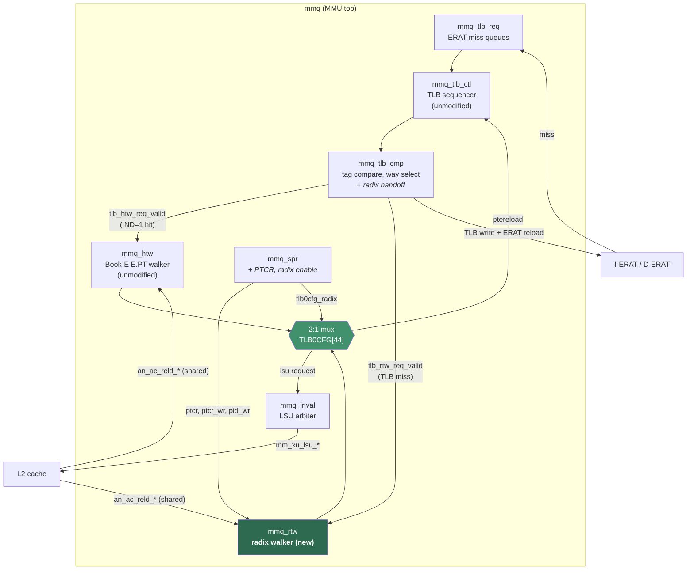

# 04 — Integration into the core

[← 03 Datapath](03-datapath.md) · [Index](00-README.md) · Next: [05 — Out-of-order safety](05-ooo-safety.md)

The design goal for integration was that **A2O with radix disabled must behave exactly as
before**. `mmq_htw.v`, the Book-E walker, is not modified in any way; the radix walker is a
sibling module selected by a configuration bit.

---

## 4.1 Module structure



The mux (`mmq.v:3760-3771`):

```verilog
assign htw_lsu_req_valid  = (mmucr1_rxe) ? rtwx_lsu_req_valid  : htwx_lsu_req_valid;
assign htw_lsu_thdid      = (mmucr1_rxe) ? rtwx_lsu_thdid      : htwx_lsu_thdid;
// ... ttype, wimge, u, addr the same way ...
// quiesce must be the AND of both: a thread is idle only when neither walker
// holds an outstanding request for it.
assign htw_quiesce_sig    = htwx_quiesce & rtwx_quiesce;
assign ptereload_req_valid = (mmucr1_rxe) ? rtwx_ptereload_req_valid : htwx_ptereload_req_valid;
```

Quiesce is an **AND**, not a mux. A thread is idle only when *neither* walker holds a
request for it; muxing would let a stale walk in the inactive walker be ignored.

## 4.2 The enable bit

Radix is selected by **`TLB0CFG[44]`**, a boot-configuration latch (`mmq_spr.v:2218`,
consumed at `mmq.v:3758`).

The obvious choice would have been a control bit in `MMUCR1` or `MMUCR2`. Neither has one
free:

| Register | Occupancy |
|---|---|
| `MMUCR1` | All 32 bits assigned. Bits 23:31 are the `EEN` error-entry-number field, **written by hardware** on error detection and cleared on read — a control bit there would be corrupted. |
| `MMUCR2` | Bits 0:11 are the `act_override` clock-gating distribution to each submodule; 12:31 are the five page-size probe-order fields. |

`TLB0CFG` bits 40:44 are reserved, and bits 45/46/47 already hold the `PT`/`IND`/`GTWE`
boot-configuration bits. Bit 44 sits directly beside them and is the exact structural
analogue of `tlb0cfg_ind`, which already gates the Book-E walker's indirect-entry search
(`mmq_tlb_ctl.v:1603, 1641, 1679, 1717, 1750`).

It resets to 0, so an unmodified A2O boots Book-E. Implementation widened the existing
three-bit boot latch to four.

## 4.3 The handoff trigger

This is the least obvious part of the integration. The Book-E handoff fires on an
**indirect-entry hit**:

```verilog
// mmq_tlb_cmp.v:5071 -- the existing Book-E condition
assign tlb_htw_req_valid = ( ... & tlb_tag4_q[`tagpos_ind] == 1'b1 &
                             tlb_tag4_q[`tagpos_nonspec] == 1'b1 &
                             tlb_tag4_wayhit_q[`TLB_WAYS] == 1'b1 & ... );
```

Radix has **no indirect entry**. The walk starts from a plain TLB *miss*. The new condition
therefore mirrors `tlb_miss_d` rather than the Book-E handoff (`mmq_tlb_cmp.v:5092`):

```verilog
// Radix walker handoff.  NOTE the trigger is the OPPOSITE of the Book-E one
// above: E.PT starts from an indirect TLB entry HIT (tagpos_ind==1), whereas a
// radix walk has no indirect entry at all and must start on a genuine TLB
// MISS. ... and -- the load-bearing term -- nonspec, so a speculative miss
// never leaves the core.
assign tlb_rtw_req_valid = ( mmucr1_rxe == 1'b1 &
                             (tlb_tag4_q[`tagpos_type_ierat] == 1'b1 |
                              tlb_tag4_q[`tagpos_type_derat] == 1'b1) &
                             tlb_tag4_q[`tagpos_type_ptereload] == 1'b0 &
                             tlb_tag4_q[`tagpos_endflag] == 1'b1 &
                             |(tlb_tag4_wayhit_q[0:`TLB_WAYS - 1]) == 1'b0 &
                             tlb_tag4_q[`tagpos_nonspec] == 1'b1 &
                             |(tag4_parerr_q[0:4]) == 1'b0 ) ? 1'b1 : 1'b0;
```

The consequence is that the TLB-miss *exception* must be suppressed when radix is enabled,
or every walk would also raise a spurious miss interrupt (`mmq_tlb_cmp.v:4378`):

```verilog
// With RXE set the miss is handed to mmq_rtw instead of being reported, or the
// thread would take a TLB-miss interrupt on every walk.
assign tlb_miss_d = ( (mmucr1_rxe == 1'b0 & ...
```

## 4.4 SPR work

### PTCR

Radix needs exactly one new architected register: **PTCR, SPR 464**, the partition-table
base pointer. Microwatt stores all 64 bits but uses only `[55:12]` (`mmu.vhdl:1846`); this
port does the same.

464 is verified free in A2O — nothing in the ranges 352–436 or 448–511 is decoded anywhere
in the core. Adding it required six edits:

| File | Edit |
|---|---|
| `mmq_spr.v:344` | `Spr_Addr_PTCR = 10'b0111010000` (unswizzled encoding) |
| `mmq_spr.v` OR-tree | Added to `spr_match_any_mmu` — **without this the SPR never asserts `done`** |
| `mmq_spr.v:1247` | Match signal |
| `mmq_spr.v:1424` | Register update, plus the `ptcr_wr`/`pid_wr` strobes the walker uses to invalidate its cached roots |
| `mmq_spr.v` read mux | Both halves (the SPR bus is split 0:31 / 32:63) |
| `xu_spr_cspr.v:1830` | `ex2_ptcr_rdec` = `10'b1000001110` (swizzled), plus the slowspr-valid, illegal-SPR and hypervisor-privilege OR-trees |

The two encodings differ because A2O decodes SPRs two ways: `xu_spr_cspr.v` uses the raw
swizzled instruction field `instr[11:20]`, while `mmq_spr.v` uses the reassembled
`slowspr_addr`. Both were derived and cross-checked against the known encodings for PID (48)
and LPIDR (338).

### SPR-space collisions

A byproduct of this work was a full comparison of the two cores' SPR spaces. Microwatt
declares 92 `SPR_*` constants; A2O decodes 138 numbers. **Nine collide** — Microwatt's
number is occupied by a different A2O register:

| Microwatt / ISA 3.x | # | A2O occupant |
|---|---:|---|
| HSPRG0 | 304 | DBSR |
| HRMOR | 313 | IAC2 |
| HSRR0 | 314 | IAC3 |
| HSRR1 | 315 | IAC4 |
| **LPCR** | **318** | **DVC1** |
| **LPIDR** | **319** | **DVC2** |
| HMER | 336 | TSR |
| HEIR | 339 | MAS5 |
| PIR | 1023 | MMUCR3 |

The pattern is systematic: A2O's Book-E debug block (304–319), timer block (336–343) and
MMU-control block (1012–1023) sit exactly where ISA 3.x places its hypervisor registers,
HEIR and PIR. A2O's own PIR is at 286 and its LPIDR at 338.

**None of these block this port.** Exactly one new number is claimed (PTCR = 464) and it is
free. The collisions are recorded because any future ISA 3.1 compliance work will hit them,
and because test software assuming ISA numbering would silently alias onto data-value-compare
debug registers.

One consequence is already visible: LPCR cannot be ported at 318, which is why the radix
enable is a `TLB0CFG` bit. Microwatt's LPCR would have been an unhelpful model in any case —
its `UPRT` and `HR` bits are hardwired to 1 (`execute1.vhdl:429-430`), meaning Microwatt is
*permanently* in radix mode. A2O must retain Book-E, so a real mode bit was always required.

## 4.5 Exception mapping

The walker reports seven fault classes. A2O's Book-E exception set has no encodings for the
radix-specific causes Microwatt distinguishes via DSISR bits 44 (bad tree) and 45
(reference/change). They are all storage interrupts, so they collapse (`mmq.v:3220-3225`):

| Radix fault | A2O output |
|---|---|
| invalid (V=0), badtree, segerror, permission, R/C | `mm_xu_pt_fault` + `ESR[PT]` + `ESR[DATA]` |
| LRAT miss | `mm_xu_lrat_miss` + `ESR[PT]` |
| machine check (watchdog, ECC escalation, RA overflow) | `mm_xu_tlb_par_err` |

```verilog
assign rtw_storage_fault = rtw_pt_fault_sig | rtw_badtree_sig | rtw_segerror_sig |
                           rtw_perm_err_sig | rtw_rc_err_sig;

assign mm_xu_pt_fault_sig    = cmpx_pt_fault_sig    | rtw_storage_fault;
assign mm_xu_lrat_miss_sig   = cmpx_lrat_miss_sig   | rtw_lrat_miss_sig;
assign mm_xu_tlb_par_err_sig = cmpx_tlb_par_err_sig | rtw_mchk_sig;
```

Collapsing is safe: the handler's response to any of them is to inspect the page tables and
re-walk. Preserving the distinct cause would require new bits in `MESR1`/`MESR2`, the MMU's
error-status registers — a reasonable extension, not attempted here.

Existing `mmq_tlb_cmp` outputs were renamed to `cmpx_*` so the architected `mm_xu_*` names
became the merged result, leaving `mmq_tlb_cmp` itself functionally unchanged.

## 4.6 Scan chain

A2O's modules sit on scan chains for test. `mmq_rtw` has two internal chains, but only one
external scan bit was left: `func_scan_in_int` is `[0:9]` and `mmq_htw` already occupies bits
7:8. The two internal chains are stitched into that one bit (`mmq.v`):

```verilog
// Only one external scan bit is left (func_scan_in_int is [0:9] and
// mmq_htw takes 7:8), so mmq_rtw's two internal chains are stitched
// into one: chain 1 feeds chain 0, chain 0 exits on bit 9.
.ac_func_scan_in( {func_scan_in_int[9], rtw_scan_link} ),
.ac_func_scan_out( {func_scan_out_int[9], rtw_scan_link} ),
```

## 4.7 What did not need changing

`mmq_tlb_ctl.v` — the 4776-line TLB sequencer — required **no modification at all**. This
was a design goal achieved by having the walker emit a standard A2O `ptepos_*` doubleword
(see [03-datapath §3.5](03-datapath.md#output-format)) rather than a TLB way. The existing
page-table-reload path, states `Stg19` through `Stg32`, carries the radix result unchanged.

`mmq_htw.v` is likewise untouched.

## 4.8 Verifying the integration did no harm

The `mmq` hierarchy lints with **the same error count as pristine upstream A2O** — three,
all of them pre-existing references to Xilinx `RAMB16` primitives that are not in the source
tree:

```bash
git worktree add /tmp/a2o-upstream master
cd /tmp/a2o-upstream/rel/src/verilog && verilator --lint-only --language 1364-2005 ... work/mmq.v   # 3
cd rel/src/verilog                   && verilator --lint-only --language 1364-2005 ... work/mmq.v   # 3
```

The `git worktree` gives a real directory holding pristine upstream `master`, so both sides
of the comparison can be linted as ordinary trees. Remove it afterwards with
`git worktree remove /tmp/a2o-upstream`.

---

**Not covered here:** why the walker needs a kill mechanism, a watchdog and a reservation
([05](05-ooo-safety.md)), or the test evidence ([06](06-verification.md)).
